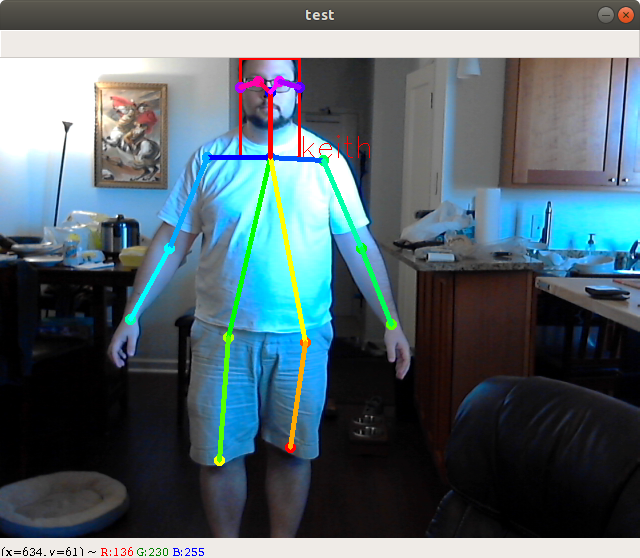

# Keith Chester

Robotics and DIY tech enthusiast.

Projects currently focus on:

* Robots
* DIY Tech
* Computer Vision
* Random Insane Ideas

---

I hold a degree in Robotics Engineering and will soon begin studying for a masters in the same from WPI. I currently work as a Senior Software Engineer for [Brain Corp](http://www.braincorp.com)'s Cloud Team.

## What Repos should you look at?

That depends on what you're looking for... 

Within you'll find a lot of repos that consist of modules created to power large projects, half baked ideas, practice repos to learn or sharpen skills, and attempts at making hardware easier to hack on.

### Hardware Hacking

* [Serial Synapse](https://github.com/hlfshell/serial-synapse) - A microcontroller that utilizes the serial-synapse defined serial messaging system can be connected to a loosely described `serial-synapse` object. `serial-synapse` would then instantly create an interactive JavaScript API object to easily automate the hardware and programmatically control it. This powered dozens of weird hardware builds throughout the years.

* [Serial Synapse Socket]() - Takes the above and instantly exposes the hardware as a web socket API

* [desk-bling](https://github.com/hlfshell/desk-bling) - A Slackbot/Particle Photon app to bling out my desk with Slack-controllable RGB LED strips
* [mqtt-scheduler](https://github.com/hlfshell/mqtt-scheduler) - A CLI and config file daemo process that allowed one to easily schedule MQTT broadcasts with human english definitions
* [garden-relay](https://github.com/hlfshell/garden-relay) - An MQTT embedded controller with LCD and button control that automated lights and pumps for my wife's indoor garden
* [lifx-mqtt](https://github.com/hlfshell/lifx-mqtt) - a program that bridges the WiFI light bulbs made by LIFX to an MQTT server, exposing core functionality as subscribable and publishable topics
* [doorbell](https://github.com/hlfshell/doorbell) - DIY raspberry pi video camera / MMS based doorbell project

### Robotics and Computer Vision

* [AI Algorithm Playground](https://github.com/hlfshell/ai_playground) - where I played around with some AI algorithms and made some fun little generators to test them

* [personable](https://github.com/hlfshell/personable) - an attempt to make human identification and tracking easier for future projects, I mashed together human pose estimation with face recognition and skeletal tracking to allow some projects interact with a person 

### node.js Projects

I wrote a lot of node.js and Typescript for a few years. Here's some of my more notable projects. 

* [CanThey](https://github.com/hlfshell/canthey) - CanThey was an ACL based authorization module with optional express module. This powered authorization on a lot of projects I've worked on.
* [pokemon-tracker](https://github.com/hlfshell/pokemon-tracker) - When `Pokemon Go` just launched and was a craze for all of a few weeks, an unofficial and bannable API was created to access and control the game. To help keep people focused at work, `pokemon-tracker` would make use of this API and create a slack bot with a fake account that would "walk" around the immediate vicinity of work and alert coworkers to the presence of any interesting pokemon.
* [needle-swap](https://github.com/hlfshell/needle-swap) - needleswap allowed unit and integration tests to override node's `require` for injecting mocks into key components. This made testing significantly easier for code that integrated with third party services
* [express-walker](https://github.com/hlfshell/express-walker) - an express service walker that would traverse directories and automatically import routes for an express server. This allowed an easy standard to be followed by a team and avoided a lot of boilerplate code.