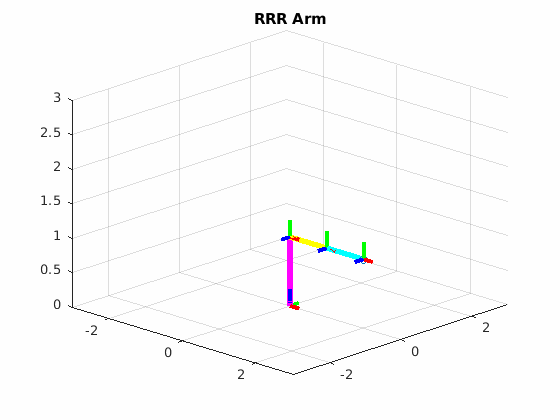
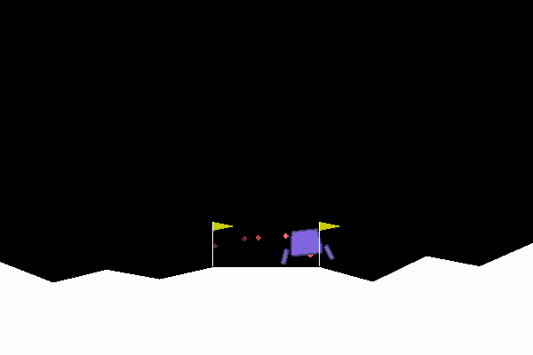
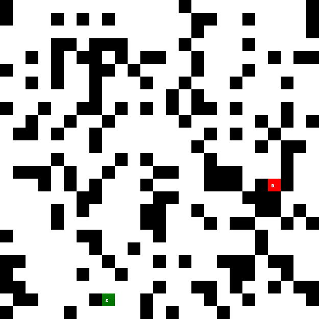
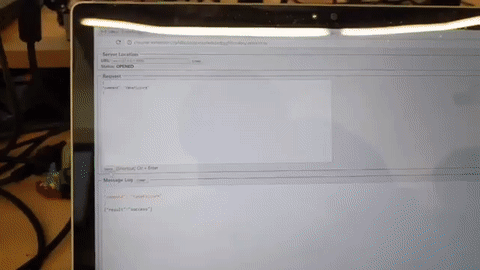

# Keith Chester

Robotics and Software Engineer with a penchant for DIY tech projects.

Projects currently focus on:

* Robotics
* Computer Vision
* DIY Tech
* Random Insane Ideas

---

I hold a bachelor's degree in Robotics Engineering and am currently studying for a Masters in the same from WPI. I currently work as a Senior Software Engineer for [Osaro](https://osaro.com/)'s Infrastructure Team. You may view my resume [here](https://github.com/hlfshell/resume).in Engineering

# Suggested Repos

...wherein you can look at some of my recent work to get an idea of the kind of projects I enjoy working on.

---

## Robotics

* **[Urban Delivery Robot w/ Local + Global Planner](https://github.com/hlfshell/rbe550-project)** - In this project we created within PyGame a homebrewed simulation of an urban environment with static (trash can, traffic cones, etc) and dynamic (moving cars) obstacles. We then created a street-map aware global planner and a kinematic modeled local planner to asynchronously path the robot from a central grocery store to assigned delivery addresses.

* **[Motion Planning with Kinematic Constraints](https://github.com/hlfshell/rbe550-valet)** - Here I explore three kinematic models - a skid drive robot, an Ackermann drive robot, and an Ackamann drive robot with attached tow trailer. In each I utilize the kinematic models and constraints of the given robot model to utilize A* to plan across a continuous space.

* **[LQR Control of an Intercept and Return Drone Airspace Protection System](https://github.com/hlfshell/RBE-502-Project)** - This group project for RBE502 (Robot Controls) had us creating a non linear controller for an interceptor drone system. The system would react to another drone entering its airspace. Utilizing a Linear Quadratic Regulator (LQR) controller, we feed the position of the target drone into the controller. Once the drone gets within a set proximity of the target, it is considered "captured" and is dragged, fighting, back to the launch site for inspection.

* **[RRT Path Search for Object Manipulation](https://github.com/hlfshell/rbe550-transmission)** - Utilizing RRT path planning across a high dimensionality space (6 dimensions consisting of 3 translations and 3 rotations), remove the top shaft out of a tight, high collision environment of a transmission.

* **[Kinematic Foundations](https://github.com/hlfshell/rbe500)** - In the first course of the masters, we explored foundations of robotics through kinematics, mostly of robotic arms. The repository has a collection of interactive or animated MATLAB livescrips (with home-made visualizations) to explain core concepts such as frames, transforms, the Jacobian, inverse kinematics, singularities, and more.

https://github.com/hlfshell/rbe550-transmission

---

## Deep Learning, AI, and Computer Vision

* **[Evolving Cars](https://github.com/hlfshell/evolving-cars)** - To experiment with evolutionary algorithms, I created a self made a race car game in PyGame where I evolve neural networks to control cars that can complete a given track successfully.

* **[Deep Q Networks](https://github.com/hlfshell/deep_q_network)** - a self-study exploration in deep reinforcement learning with Deep Q Networks - applied to a few OpenAI gyms.

* **[personable](https://github.com/hlfshell/personable)** - an attempt to make human identification and tracking easier for future projects, I mashed together human pose estimation with face recognition and skeletal tracking to allow some projects interact with a person

* **[Behavioral Cloning](https://github.com/hlfshell/udacity_carnd_behavioral_cloning)** - final project for the Udacity Self Driving Car Nanodegree. A CNN observes simulated car's manual driving and then manages to reproduce the behavior of steering to staying in-lane on a race course.

* **[Lane Detection](https://github.com/hlfshell/Udacity-CarND-Advanced-Lane-Finding)** - homework assignment for the Udacity Self Driving Car Nanodegree. Utilizes thresholding and sobel edge edge detection to determine lane curvature.

* **[Vehicle Detection](https://github.com/hlfshell/Udacity-CarND-VehicleDetection)** - homework assignment for the Udacity Self Driving Car Nanodegree. Within is a classical computer vision vehicle detector utilizing a histogram of gradients (*HoG*) to identify vehicles in a video.

* **[AI Algorithm Playground](https://github.com/hlfshell/ai_playground)** - where I played around with some AI algorithms and made some fun little generators to test them

---

## Hardware Hacking Fun

* **[Serial Synapse](https://github.com/hlfshell/serial-synapse)** - A microcontroller that utilizes the serial-synapse defined messaging protocol can be connected to a loosely described node.js `serial-synapse` object. `serial-synapse` would then instantly create an interactive node API object to easily automate the hardware and programmatically control it. Asynchronous control, reacting to MCU feedback, and node->MCU hardware control is made effortless. This powered dozens of weird hardware builds throughout the years.

* **[Serial Synapse Socket](https://github.com/hlfshell/serial-synapse-socket)** - Takes the above and instantly exposes the hardware as a web socket API

* **[desk-bling](https://github.com/hlfshell/desk-bling)** - A Slackbot/Particle Photon app to bling out my desk with Slack-controllable RGB LED strips

* **[mqtt-scheduler](https://github.com/hlfshell/mqtt-scheduler)** - A CLI and config file daemon process that allowed one to easily schedule MQTT broadcasts with human english definitions

* **[garden-relay](https://github.com/hlfshell/garden-relay)** - An MQTT embedded controller with LCD and button control that automated lights and pumps for my wife's indoor garden

* **[lifx-mqtt](https://github.com/hlfshell/lifx-mqtt)** - a program that bridges the WiFI light bulbs made by LIFX to an MQTT server, exposing core functionality as subscribable and publishable topics

* **[doorbell](https://github.com/hlfshell/doorbell)** - DIY raspberry pi video camera / MMS based doorbell project

* **[mlx90621-electron](https://github.com/hlfshell/mlx90621-electron)** - Electron app w/ thermal sensor for low res DIY thermal camera

---

## golang

The vast majority of my golang work is under private repos - I have not had the opportunity to prepare too much open source go work.

* **[SafeStop](https://github.com/hlfshell/safestop)** - SafeStop is a service that coordinates safely shutting down and halting services and daemonized processes for larger applications when a `SIGINT`, `SIGTERM`, or equivalent is triggered.

---

## node.js Projects

I wrote a lot of node.js and Typescript for a few years. Here's some of my more notable projects. 

* **[CanThey](https://github.com/hlfshell/canthey)** - CanThey was an ACL based authorization module with optional express module. This powered authorization on a lot of projects I've worked on.
* **[pokemon-tracker](https://github.com/hlfshell/pokemon-tracker)** - When `Pokemon Go` just launched and was a craze for all of a few weeks, an unofficial and bannable API was created to access and control the game. To help keep people focused at work, `pokemon-tracker` would make use of this API and create a slack bot with a fake account that would "walk" around the immediate vicinity of work and alert coworkers to the presence of any interesting pokemon.
* **[needle-swap](https://github.com/hlfshell/needle-swap)** - needleswap allowed unit and integration tests to override node's `require` for injecting mocks into key components. This made testing significantly easier for code that integrated with third party services
* **[express-walker](https://github.com/hlfshell/express-walker)** - an express service walker that would traverse directories and automatically import routes for an express server. This allowed an easy standard to be followed by a team and avoided a lot of boilerplate code.
