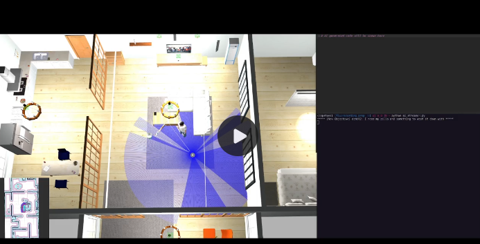

# Keith Chester

Robotics and Cloud Software Engineer with a penchant for DIY tech projects.

My blog can be found [here](https://hlfshell.ai).

You may view my resume [here](https://github.com/hlfshell/resume).

---

I am a software engineer with over a dozen years of experience. I will soon receive a Masters in Robotics Engineering from WPI, where I have been working heavily on navigation, reinforcement learning, computer vision, deep learning, and AI for robotics.

For the past 5 years I have specialized in developing:

* Edge robotic fleet data pipelines
* Deep learning pipelines
* Control, configuration, and fleet management systems for global robot deployments

---

* [Robotics](#robotics)
    * [AI](#ai-and-robotics)
    * [Robotics](#robotics)
    * [Reinforcement Learning](#reinforcement-learning)
    * [Deep Learning](#ai--deep-learning)
    * [Computer Vision](#computer-vision)
* [LLM Work](#llm-work)
* [Reinforcement Learning](#reinforcement-learning-1)
* [Hardware Hacking Fun](#hardware-hacking-fun)
* [Pure Software](#pure-software)
    * [Golang](#golang)
    * [nodejs](#nodejs)

# Robotics

## AI

* **[LLM Powered Contextually Aware Task Planning](https://github.com/hlfshell/wpi-capstone)** - My Master's capstone project, we built out a modified home environment with a robotic agent to act as an object retriever for a human user. The robot had a vision-powered understanding of world state, paired with a set of actionable APIs to build higher level behavior to control movement and grasping/interaction. LLM agents considered world state with human-language requests to generate multiple task plans, rate them, and execute the chosen one to accomplish the given task.

## Reinforcement Learning

* **[PPO Reinforcement Learning Controlling a Robotic Arm](https://github.com/hlfshell/rbe595-rl-project)** - [**Blog post**](https://hlfshell.ai/posts/ppo-pick-and-place/) - Proximal Policy Optimization (PPO) and reinforcement learning controls a robotic arm trying to slide various shapes into specific sorting bins.

* **[Behavioral Cloning](https://github.com/hlfshell/udacity_carnd_behavioral_cloning)** - final project for the Udacity Self Driving Car Nanodegree. A CNN observes simulated car's manual driving and then manages to reproduce the behavior of steering to staying in-lane on a race course.

## Computer Vision

* **[Semantic Segmentation for Self Driving Cars](https://github.com/hlfshell/rbe549-project-segmentation)** - Final project for the WPI RBE549 graduate computer vision course, our team automated the CARLA car simulator to generate a dataset and train a semantic segmentation network for driving applications.

* **[birdseye](https://github.com/hlfshell/hivenote)** - *birdseye is a work in progress*. I'm trying to utilize 4 orthogonal cameras on a vehicle to recreate the overhead view looking down of the vehicle and its cityscape, as well as create a semantically segmented view.

* **[Vehicle Detection](https://github.com/hlfshell/Udacity-CarND-VehicleDetection)** - assignment for the Udacity Self Driving Car Nanodegree. Within is a classical computer vision vehicle detector utilizing a histogram of gradients (*HoG*) to identify vehicles in a video.

* **[Lane Detection](https://github.com/hlfshell/Udacity-CarND-Advanced-Lane-Finding)** - assignment for the Udacity Self Driving Car Nanodegree. Utilizes thresholding and sobel edge edge detection to determine lane curvature.

* **[personable](https://github.com/hlfshell/personable)** - a deprecated hack experiment from years ago. I wanted to make human identification and tracking easier for future projects, so I mashed together human pose estimation with face recognition and skeletal tracking. The idea was more natural contextually smart IoT projects (Keith is in the living room on the couch reading and it is night, so let's turn on the lamp above his head).

## Navigation

* **[Urban Delivery Robot w/ Local + Global Planner](https://github.com/hlfshell/rbe550-project)** - In this project we created within PyGame a homebrewed simulation of an urban environment with static (trash can, traffic cones, etc) and dynamic (moving cars) obstacles. We then created a street-map aware global planner and a kinematic modeled local planner to asynchronously path the robot from a central grocery store to assigned delivery addresses.

* **[Motion Planning with Kinematic Constraints](https://github.com/hlfshell/rbe550-valet)** - Here I explore three kinematic models - a skid drive robot, an Ackermann drive robot, and an Ackermann drive robot with attached tow trailer (pictured). In each I utilize the kinematic models and constraints of the given robot model to utilize A* to plan across a continuous space.

* **[LQR Control of an Intercept and Return Drone Airspace Protection System](https://github.com/hlfshell/RBE-502-Project)** - This group project for RBE502 (Robot Controls) had us creating a non linear controller for an interceptor drone system. The system would react to another drone entering its airspace. Utilizing a Linear Quadratic Regulator (LQR) controller, we feed the position of the target drone into the controller. Once the drone gets within a set proximity of the target, it is considered "captured" and is dragged, fighting, back to the launch site for inspection.

* **[RRT Path Search for Object Manipulation](https://github.com/hlfshell/rbe550-transmission)** - Utilizing RRT path planning across a high dimensionality space (6 dimensions consisting of 3 translations and 3 rotations), remove the top shaft out of a tight, high collision environment of a transmission.

---

# LLM Work

* **[coppermind](https://github.com/hlfshell/coppermind)** - coppermind is an importable or stand alone backend for empowering LLM-powered AI agents written in Go. It injects personalities, memories, and knowledge into agents via generative embeddings and conversation self-summarization.

* **[Tree of Thoughts Engine](https://github.com/hlfshell/tot-engine)** - I wanted to experiment with using the Tree of Thoughts approach for higher level abstract reasoning. This is my attempt to build a generic engine for powering the approach and see what I could learn from it.

* **[State of the Art in LLMs + Robotics 2023](/posts/llms-and-robotics-papers-2023/)** - This was a research article written and shared here to collect the current best research on applying LLMs and transformers to robotic applications. It acted as an excellent primer for diving into my LLM context planner project.

---

# Reinforcement Learning

* **[Evolving Cars](https://github.com/hlfshell/evolving-cars)** - To experiment with evolutionary algorithms, I created a self made a race car game in PyGame where I evolve neural networks to control cars that can complete a given track successfully.

* **[Deep Q Networks](https://github.com/hlfshell/deep_q_network)** - a self-study exploration in deep reinforcement learning with Deep Q Networks - applied to a few OpenAI gyms.

* **[Evolutionary Algorithms to Solve Chicago Traffic](https://github.com/hlfshell/cs534-project)** - Using the SUMO traffic simulator, I used its Python API to automate the simulator and train an evolutionary algorithm trained AI to control traffic lights, aiming to reduce travel time throughout the city for simulated cars.

---

# Hardware Hacking Fun

* **[hivenote](https://github.com/hlfshell/hivenote)** - *Work in progress* - hivenote is a physical interaction media player, meant to be a mix of an in-home art installation and media device.

* **[Serial Synapse](https://github.com/hlfshell/serial-synapse)** - A microcontroller that utilizes the serial-synapse defined messaging protocol can be connected to a loosely described node.js `serial-synapse` object. `serial-synapse` would then instantly create an interactive node API object to easily automate the hardware and programmatically control it. Asynchronous control, reacting to MCU feedback, and node->MCU hardware control is made effortless. This powered dozens of weird hardware builds throughout the years.

* **[Serial Synapse Socket](https://github.com/hlfshell/serial-synapse-socket)** - Takes the above and instantly exposes the hardware as a web socket API

* **[desk-bling](https://github.com/hlfshell/desk-bling)** - A Slackbot/Particle Photon app to bling out my desk with Slack-controllable RGB LED strips. Reacted to incoming messages, keyword triggers, and certain events for special lighting effects (lunchtime? disco mode!)

* **[mqtt-scheduler](https://github.com/hlfshell/mqtt-scheduler)** - A CLI and config file daemon process that allowed one to easily schedule MQTT broadcasts with human understandable timing ("turn the garden pump on at 7:00pm on Tuesdays").

* **[garden-relay](https://github.com/hlfshell/garden-relay)** - An MQTT embedded controller with LCD and button control that automated lights and pumps for my wife's indoor garden

* **[lifx-mqtt](https://github.com/hlfshell/lifx-mqtt)** - a program that bridges the WiFI light bulbs made by LIFX to an MQTT server, exposing core functionality as subscribable and publishable topics

* **[doorbell](https://github.com/hlfshell/doorbell)** - DIY raspberry pi video camera / MMS based doorbell project

* **[mlx90621-electron](https://github.com/hlfshell/mlx90621-electron)** - Electron app w/ thermal sensor for low res DIY thermal camera

---

# Pure Software

## golang

* **[docker-harness](https://github.com/hlfshell/docker-harness)** - Dead simple golang docker harness for testing. Sometimes you just need to test the SQL query in the actual database. I have used this for many complicated tests and creating tooling for coordinating load tests.

* **[SafeStop](https://github.com/hlfshell/safestop)** - SafeStop is a service that coordinates safely shutting down and halting services and daemonized processes for larger applications when a `SIGINT`, `SIGTERM`, or equivalent is triggered.

## nodejs

*This stuff is **old**, but included because why not?*

* **[CanThey](https://github.com/hlfshell/canthey)** - CanThey was an ACL based authorization module with optional express integration. This powered authorization on a lot of projects I've worked on.
* **[needle-swap](https://github.com/hlfshell/needle-swap)** - needleswap allowed unit and integration tests to override node's `require` for injecting mocks into key components. This made testing significantly easier for code that integrated with third party services
* **[express-walker](https://github.com/hlfshell/express-walker)** - an express service walker that would traverse directories and automatically import routes for an express server in a predictable manner. This allowed an easy standard to be followed by a team and avoided a lot of boilerplate code.
* **[controlled-merge](https://github.com/hlfshell/controlled-merge)** - allowed merging of multiple javascript objects into a singular object, with an optional function parameter for custom rules on handling conflicts.
* **[node-packer](https://github.com/hlfshell/node-packer)** - a node wrapper library for [Packer](https://www.packer.io/) for programmatically building images in node.
* **[pokemon-tracker](https://github.com/hlfshell/pokemon-tracker)** - When `Pokemon Go` just launched and was a craze for all of a few weeks, an unofficial and bannable API was created to access and control the game. To help keep people focused at work, `pokemon-tracker` would make use of this API and create a slack bot with a fake account that would "walk" around the immediate vicinity of work and alert coworkers to the presence of any interesting pokemon.
